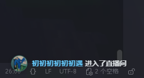
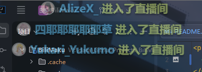
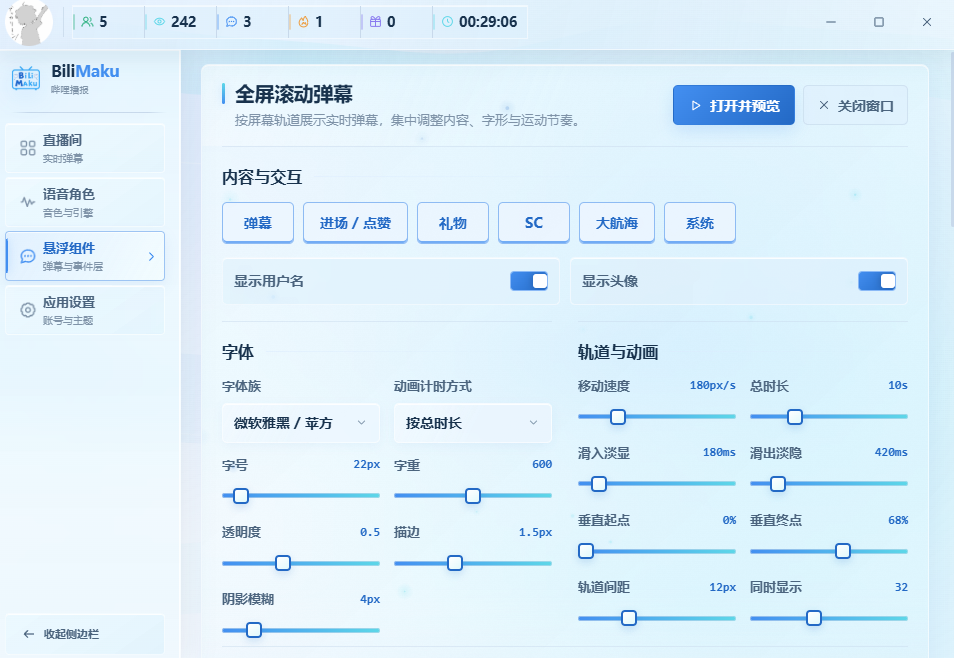
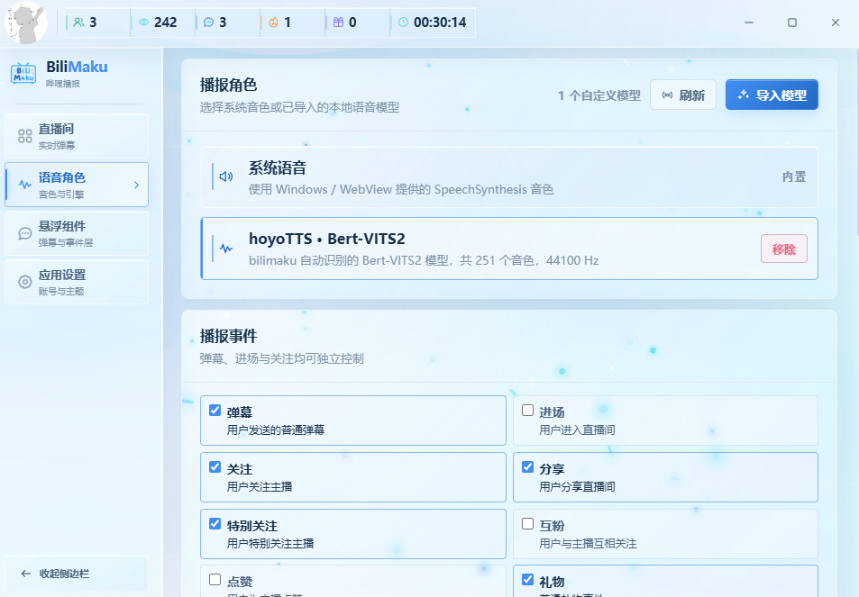

<p align="center">
  
</p>

<h1 align="center">BiliMaku · 哔哩播报</h1>

<p align="center">基于 React、Rust 与 Tauri 2 的桌面直播弹幕播报工具。</p>

<p align="center">
  <a href="https://github.com/WJZ-P/BiliMaku/releases"></a>
  <a href="https://github.com/WJZ-P/BiliMaku/actions/workflows/release.yml"></a>
  <a href="LICENSE"></a>
</p>

<p align="center">
  <a href="https://www.bilibili.com/video/BV1Yx411T7Uz">
    
  </a>
</p>
<h2 align="center">"歌唱着BILIBILI 跟我一起 探寻这美丽的天地"</h2>

## UI展示

<p align="center">
  <a href="https://www.bilibili.com/video/BV1Yx411T7Uz">
    
  </a>
</p>

<h3 align="center">登录UI</h3>

---

<p align="center">
  <a href="https://www.bilibili.com/video/BV1Yx411T7Uz">
    
  </a>
</p>

<h3 align="center">直播间界面，支持发送文字、表情，接受各种消息</h3>

---

<p align="center">
  <a href="https://www.bilibili.com/video/BV1Yx411T7Uz">
    
  </a>
</p>

<h3 align="center">侧边栏悬浮窗，接受入场、礼物、弹幕等消息</h3>

---

<p align="center">
  <a href="https://www.bilibili.com/video/BV1Yx411T7Uz">
    
  </a>
</p>

<h3 align="center">全屏滚动弹幕，就像哔哩哔哩！</h3>

---

<p align="center">
  <a href="https://www.bilibili.com/video/BV1Yx411T7Uz">
    
  </a>
</p>

<h3 align="center">支持丰富的自定义选项！</h3>

---

<p align="center">
  <a href="https://www.bilibili.com/video/BV1Yx411T7Uz">
    
  </a>
</p>

<h3 align="center">支持自定义导入bert-vits2模型进行弹幕播报</h3>

---

## 功能

- 扫码登录并恢复本地会话；
- 连接直播间，接收弹幕、礼物、SC、大航海与互动事件；
- 使用系统语音或本地 Bert-VITS2 自定义音色播报；
- 提供全屏滚动弹幕与透明侧边事件悬浮窗；
- 支持浅色模式、深色模式与 WebGL 界面动效。

> Release 不包含 PyTorch、BERT、音色权重或用户 Cookie。

## 开发

需要 Node.js 22、npm、Rust stable、Microsoft C++ Build Tools 和 WebView2 Runtime。

```powershell
git clone https://github.com/WJZ-P/BiliMaku.git
cd BiliMaku
npm ci
npm run tauri:dev
```

检查项目：

```powershell
npm run check
npm run build
cargo test --manifest-path src-tauri/Cargo.toml --locked
```

## 发布

推送 `vMAJOR.MINOR.PATCH` 格式的 Git Tag 后，`.github/workflows/release.yml` 会校验所有版本号、构建 Windows NSIS/MSI 安装包，并创建同名 Release：

```powershell
git tag v1.0.0
git push origin v1.0.0
```

Release 标题仅使用 Tag，例如 `v1.0.0`。

## License

[GNU AGPL v3](LICENSE)

## ⭐ Star 历史


**如果你喜欢这个项目，请给个 ⭐ 吧(๑>◡<๑)！**

[](https://starchart.cc/WJZ-P/BiliMaku)
