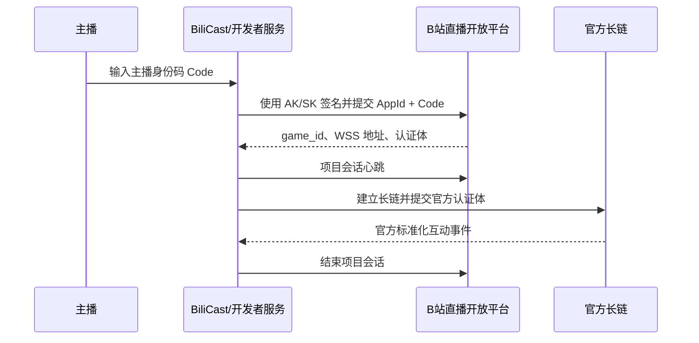
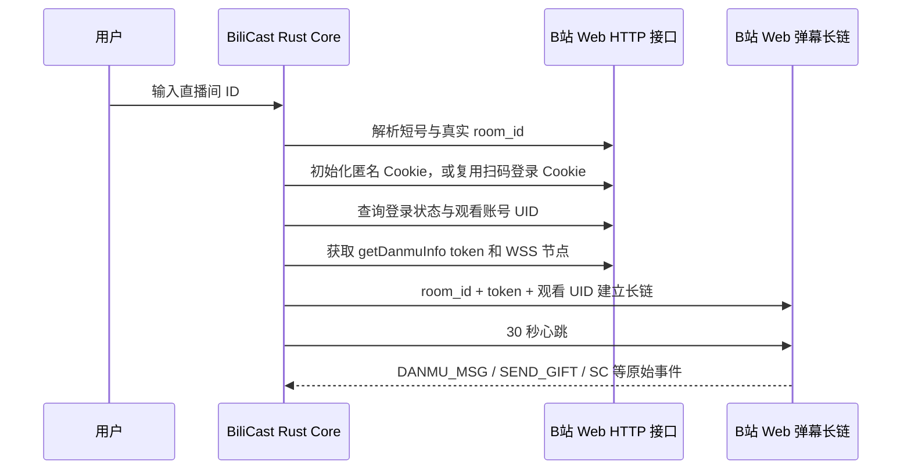

# BiliCast 直播弹幕接入技术报告

> 版本：0.2
> 日期：2026-08-05  
> 范围：主播身份码、房间号直连、权限边界，以及头像缺失诊断

## 1. 结论摘要

1. 老牌弹幕工具要求的“码”通常是 **主播身份码 Code**。它采用的是 B 站直播开放平台的“互动玩法”接入：开发者应用先用 `AccessKeyId`、`AccessKeySecret` 签名，再提交 `AppId + Code` 启动一场已获主播授权的项目会话。
2. BiliCast 当前采用 **Web Live Adapter**，并同时支持匿名与扫码登录两种观看会话。直播间 ID 只是公开直播间的寻址信息，程序以 Web 观看端的方式获取弹幕长链令牌并订阅公开事件，因此用户侧连接房间时只填房间号。
3. BiliCast 可以切换到其他公开直播间。短房间号会先解析成真实房间号，然后建立对应长链。这个能力等价于“进入另一个公开直播间观看事件”，并不附带主播后台、房管、发弹幕或直播控制权限。
4. 两种模式的核心差异并非“有没有 WebSocket”，而是 **授权主体与服务边界**：身份码模式证明“某位主播允许某个开发者项目为本场直播运行”；房间号模式只表明“客户端想订阅这个公开房间的观看端事件流”。
5. 本次头像缺失已定位为 **CDN 防盗链 Referer 策略**，不是普通 CORS。实测同一头像 URL：无 `Referer` 返回 `200 image/jpeg`，携带 `Referer: http://tauri.localhost/` 返回 `403 text/html`。
6. 当前 Web 长链已实测收到 `INTERACT_WORD_V2`。BiliCast 已增加 Base64 Protobuf 解码，可输出进场、关注、分享三类互动事件及平台下发的昵称、头像。
7. BiliCast 已落地二维码登录：Rust 端生成二维码、轮询确认、保存 Cookie，并在连接时把登录账号 UID 和 Cookie 注入 Web 长链。登录态是否带来更完整的进场身份字段，需要用同一房间的实际事件做 A/B 对照。

## 2. 两种连接方式

### 2.1 官方互动玩法：身份码模式

官方示例明确要求四项参数：

- `AccessKeyId`
- `AccessKeySecret`
- `AppId`
- 主播身份码 `Code`

参考：[B 站官方 OpenLive C# Demo](https://github.com/bilibili-openplatform/OpenLive_CSharpDemo)。

典型流程如下：



官方示例代码实际调用 `StartInteractivePlay(code, appId)`，得到 `game_id` 后同时运行玩法心跳和 WebSocket，结束时再调用 `EndInteractivePlay(appId, gameId)`。参考：[官方示例 Program.cs](https://github.com/bilibili-openplatform/OpenLive_CSharpDemo/blob/main/OpenBLiveSample/Program.cs)。

因此，`Code` 不是单独的“弹幕密码”，而是把以下三件事绑定起来的短期授权材料：

- 哪位主播授权；
- 哪个开放平台应用在运行；
- 哪一场互动玩法会话正在产生数据。

### 2.2 BiliCast 当前实现：房间号 Web 模式

BiliCast 当前链路：



这里的房间号是 **资源地址**，不是主播授权凭据。网页访客本来就需要知道当前房间并接收公开弹幕，BiliCast 复用了这条观看端数据路径，然后在本机完成 Brotli/zlib 解包、事件归一化和播报。

当前进场消息已由旧版 `INTERACT_WORD` 升级为 `INTERACT_WORD_V2`，主体是 Base64 编码的 Protobuf。BiliCast 同时保留旧 JSON 解析，并实现 V2 中的昵称、头像和 `msg_type` 解码：`1` 为进场、`2` 为关注、`3` 为分享。

### 2.3 进场昵称脱敏与登录态

BiliCast 现在支持两种 **Web 观看会话**：匿名连接的长链鉴权 `uid = 0`；扫码登录后，Rust 会话先通过账号导航接口读取 `mid`，再将该 UID、Cookie、`buvid` 与当前会话获取的弹幕令牌用于长链握手。主流 Web 长链实现也采用相同分支：没有 `SESSDATA` 时使用 `uid = 0`，存在登录态时查询账号 `mid` 并写入鉴权体。参考：[blivedm Web 客户端源码](https://github.com/xfgryujk/blivedm/blob/dev/blivedm/clients/web.py)。

扫码链路全部位于 Rust 端：

1. 请求 Web 二维码生成接口，得到一次性扫码 URL 与 `qrcode_key`；
2. 本地将 URL 渲染为 SVG 二维码，React 端只拿到图片 Data URL；
3. 每 1.5 秒轮询一次扫码状态，区分待扫码、待手机确认、已登录和已过期；
4. 登录成功后由 Rust Cookie Jar 接收站点 Cookie，并调用账号导航接口校验昵称、头像和 UID；
5. 连接直播间时复用同一个 HTTP 会话，前端只得到非敏感账号摘要与 `accessMode`；
6. 登出或切换账号时直接替换整个 Cookie Jar，避免旧会话残留。

当前版本选择内存会话：Cookie 不落盘，关闭应用后重新扫码。这适合先完成同房间匿名/登录 A/B 验证；若后续增加持久化，应使用系统凭据库或强保护存储，并单独设计过期刷新与撤销流程。

对两条真实 `INTERACT_WORD_V2` 原始 Protobuf 做逐字段审计后，匿名会话收到的昵称字段本身就是类似 `在***`、`啦***` 的值；`uinfo.base.name` 只是重复该脱敏值，包内没有对应的完整昵称或数字 UID。因此这不是 BiliCast 解析器主动打码，也不是漏读了另一个普通字段；星号字符串本身没有可供本地还原的映射信息。

若产品需要识别进场用户，应继续维护两条明确的数据路径：

1. **Web 登录态适配器（已实现）**：仍然输入房间号，由用户扫码建立观看账号登录态，再进行同房间匿名/登录 A/B 验证。登录态可能改变服务端下发字段，不过结果仍受站内隐私与风控策略控制，工程上以实测为准。
2. **OpenLive 官方适配器**：由主播身份码启动项目会话。官方长连的进场事件 `OPEN_LIVEROOM_LIVE_ROOM_ENTER` 定义了 `uname`、`uface`、`open_id` 等字段，更适合稳定的用户归一化；其中 `open_id` 应作为业务主键。进场高峰时该事件存在服务端限流，最低保障不低于 10 QPS。参考：[B 站开放平台长连 CMD 文档](https://bilibili.apifox.cn/doc-7499813)。

### 2.4 实时人气与在线人数

BiliCast 已经每 30 秒解析一次 Web 长链 `operation = 3` 的四字节心跳回复，并将它作为 `popularity` 显示为“直播间人气值”。部分站内 HTTP 接口把同一类指标命名为 `online`，但该值属于经过平台计算的热度指标，不应标注为精确并发观看人数。

2026-08-05 的同房间对照请求中，`online` 返回 `11002`，推荐流里的 `watched_show` 同时显示“52人看过”。这两个字段显然描述不同统计口径：前者是实时变化的人气/热度，后者是“人看过”展示量，也不是当前并发连接数。

当前 OpenLive 文档中的长链心跳响应为 `data: {}`，直播间基础/详细信息也没有在线人数栏位。通过进场减退出的方式推算同样不可靠：官方进场推送存在动态 QPS 限流，并明确说明退出检测属于异步猜测，因数据不可信而未定义退出事件。参考：[官方长链心跳](https://bilibili.apifox.cn/api-360180859)、[官方直播间基础信息](https://bilibili.apifox.cn/api-360174462)、[官方进场与退出说明](https://bilibili.apifox.cn/doc-7499813)。

当前主流 Web 弹幕客户端也从原始 `DANMU_MSG` 中解析用户和头像字段；例如 blivedm 的 Web 模型从 `info[0][15].user.base.face` 读取头像，并在字段缺失时回退为空值。参考：[blivedm Web 事件模型](https://github.com/xfgryujk/blivedm/blob/dev/blivedm/models/web.py)。

## 3. 是否可以连接别的房间号

**可以。** 当前输入框接受短房间号或真实房间号：

1. BiliCast 查询房间信息；
2. 将短号解析为真实 `room_id`；
3. 为该真实房间获取弹幕 token 与可用 WSS 节点；
4. 断开上一条会话并建立新房间会话。

适用范围是可由普通 Web 观看端访问的公开直播间。停播房间通常没有实时弹幕；受限房间、平台风控或 Web 协议调整也可能导致连接失败或事件字段减少。

跨房间订阅并不表示获得该房间的主播身份。BiliCast 当前的能力是接收和播报公开事件，不执行发言、禁言、房管、开播、下播等账号操作。

## 4. 权限与工程属性对比

| 维度 | 房间号 Web 模式（当前） | 官方身份码模式 |
|---|---|---|
| 用户输入 | 房间 ID | 主播身份码 Code |
| 开发者凭据 | 用户侧无 | `AppId + AccessKeyId + AccessKeySecret` |
| 授权含义 | 订阅公开房间的观看端事件 | 主播授权指定应用启动互动玩法会话 |
| 房间范围 | 可切换到其他公开房间 | 当前 Code 对应的主播/房间与项目会话 |
| 数据形态 | Web 原始命令，字段会随站内协议变化 | 开放平台定义的命令和数据结构 |
| 生命周期 | WSS 鉴权、长链心跳、重连 | 启动玩法、`game_id`、玩法心跳、官方 WSS、结束玩法 |
| 主播身份确认 | 无 | 有，Code 用于建立主播授权关系 |
| 主播后台/房管权限 | 不包含 | Code 本身也不是通用房管令牌；具体能力由开放平台项目接口决定 |
| 稳定性责任 | BiliCast 维护 Web 协议适配 | 以官方开放平台文档和版本为接入边界 |
| 推荐场景 | 本地工具、快速试用、跨公开房间监听 | 面向主播正式发行、互动玩法、长期产品化 |

一个容易混淆的点是：**官方模式的授权更明确，不等于自动获得更多账号操作权。** 它主要增加主播授权、项目身份、官方会话生命周期和标准化事件边界；具体写操作仍取决于开放平台为该应用开放的接口。

## 5. 为什么老牌弹幕工具选择身份码

这通常是产品路线选择，而不是基础 WebSocket 技术限制：

1. **正式分发**：面向大量主播时，需要清楚记录“哪位主播授权了哪个应用”。
2. **官方协议边界**：开放平台提供明确的启动、心跳、结束与消息命令约定。
3. **数据治理**：项目、主播和场次通过 `AppId / Code / game_id` 关联，更适合运营统计与平台审核。
4. **维护成本**：Web 观看端属于站内协议，字段、签名或风控策略变化时，需要客户端自行跟进。
5. **功能规划**：若后续要做正式互动玩法，官方会话比匿名观看端订阅更匹配。

对 BiliCast 而言，房间号模式非常适合当前“本地智能播报”目标；进入公开发行和商业化阶段后，增加官方适配器会更稳妥。

## 6. 头像缺失诊断与修复

### 6.1 实测证据

2026-08-05 的真实长链测试确认：

- `DANMU_MSG` 原包存在 `info[0][15].user.base.face`；
- Rust 归一化后的 `avatar` 是完整 HTTPS URL；
- 同一头像 URL 的请求结果：
  - 不发送 `Referer`：`200 OK`、`image/jpeg`、32641 bytes；
  - `Referer: http://tauri.localhost/`：`403 Forbidden`、`text/html`；
  - `Referer: https://live.bilibili.com/`：`200 OK`。

这说明数据获取和字段解析都正常，图片 CDN 根据来源头进行了防盗链判断。

### 6.2 为什么不是普通 CORS

普通 `` 在未设置 `crossorigin` 时会发送非 CORS 图片请求；浏览器主要限制脚本读取跨域图片像素，而不是禁止图片本身显示。MDN 对 `` 的说明也区分了 `crossorigin` 与 `referrerpolicy`：`no-referrer` 会让图片请求省略 `Referer` 头。参考：[MDN `` 文档](https://developer.mozilla.org/en-US/docs/Web/HTML/Reference/Elements/img)。

“这是自己的桌面软件”也不代表 WebView 没有来源。Tauri 前端仍运行在 WebView 文档来源中，本次请求实际携带了 `http://tauri.localhost/`，CDN 正是依据这个值返回 403。

### 6.3 已落地修复

`DashboardPage.tsx` 已完成：

- 图片使用 `referrerPolicy="no-referrer"`；
- `http://` 和 `//` 头像地址统一升级为 HTTPS；
- 图片加载失败时自动显示用户名首字兜底；
- 使用 `loading="lazy"` 减少长弹幕列表的图片请求量；
- 所有样式继续由 Linaria styled components 管理。

## 7. 推荐的 BiliCast 路线

采用双适配器最合适：

```text
LiveAdapter
├── WebLiveAdapter
│   ├── AnonymousSession       # 房间号 + uid=0
│   └── AuthenticatedSession   # 扫码 Cookie + 观看账号 UID
└── OpenLiveAdapter            # 身份码，官方项目会话
        ↓
EventNormalizer
        ↓
RuleEngine → SpeechQueue → TtsAdapter
```

建议优先级：

1. 保留房间号模式作为默认入口，用已实现的扫码登录做匿名/登录字段回归；
2. 增加原始事件诊断导出，沉淀同一房间两种会话的脱敏样本；
3. 增加“官方身份码模式”开关；
4. 正式发行时将 `AccessKeySecret` 放在签名服务中，桌面端只提交主播 Code，避免把开发者密钥打进安装包；
5. 两种适配器统一输出 `LiveEvent`，上层播报逻辑保持解耦；
6. 为 Web Adapter 增加协议回归样本，为 OpenLive Adapter 增加启动、心跳、结束的会话测试。

## 8. 本次验证记录

```text
npm run check                                  PASS
npm run build                                  PASS
cargo test --manifest-path src-tauri/Cargo.toml PASS
真实房间 WSS 鉴权                              PASS
真实房间心跳响应                               PASS
真实 DANMU_MSG 头像字段                        PASS
真实 INTERACT_WORD_V2 进场事件                 PASS
V2 Protobuf 昵称、头像、互动类型解码            PASS
头像 CDN Referer 对照实验                      200 / 403 / 200，结论明确
二维码 SVG 生成单元测试                         PASS
匿名账号状态单元测试                            PASS
真实二维码生成与待扫码轮询                       PASS
登录 Cookie / UID 注入长链                      代码与编译验证通过，待用户扫码做真实 A/B
```

## 9. 参考资料

- [B 站官方 OpenLive C# Demo](https://github.com/bilibili-openplatform/OpenLive_CSharpDemo)
- [B 站官方 OpenLive Program.cs](https://github.com/bilibili-openplatform/OpenLive_CSharpDemo/blob/main/OpenBLiveSample/Program.cs)
- [B 站直播开放文档](https://open-live.bilibili.com/document/)
- [blivedm Web 事件模型](https://github.com/xfgryujk/blivedm/blob/dev/blivedm/models/web.py)
- [MDN `` 元素与 referrer policy](https://developer.mozilla.org/en-US/docs/Web/HTML/Reference/Elements/img)
